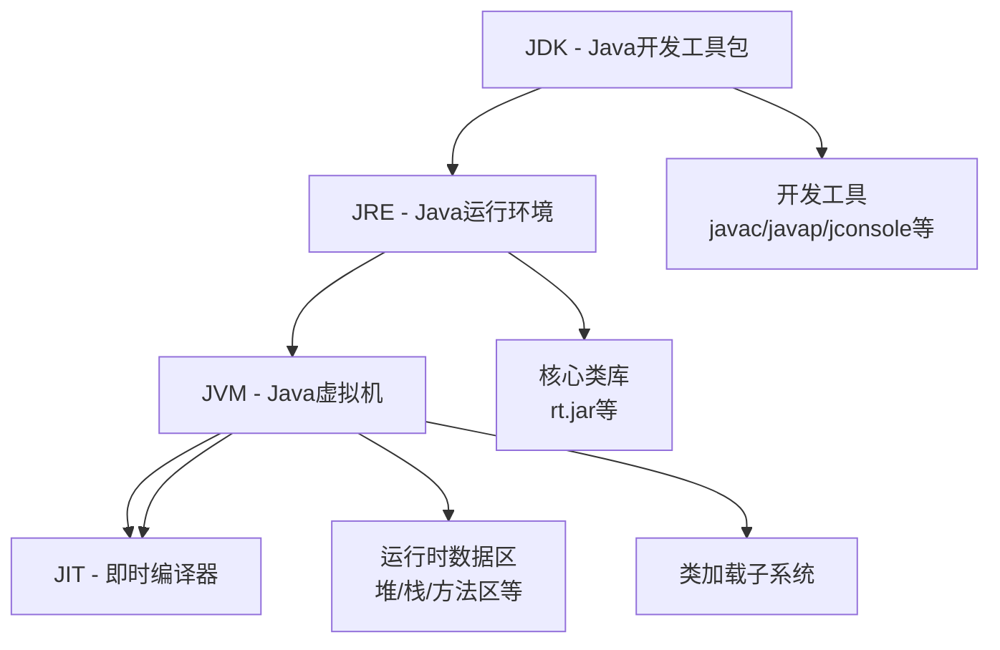

## JVM、JRE、JDK、JIT 关系详解

### 一、核心概念

#### 1. **JVM（Java Virtual Machine） - Java虚拟机**
**本质**：Java程序运行的**执行环境**（虚拟机）
**功能**：
- 加载、验证、执行字节码（.class文件）
- 内存管理（堆、栈、方法区等）
- 垃圾回收（GC）
- 提供运行时环境
**特点**：
- 平台无关性（Write Once, Run Anywhere）
- 不同操作系统有不同的JVM实现
- 执行字节码指令

#### 2. **JRE（Java Runtime Environment） - Java运行环境**
**组成**：**JVM + 核心类库 + 其他支持文件**
**功能**：
- 运行Java程序的最小环境
- 包含基础类库（java.lang、java.util等）
- 不包含开发工具
**定位**：面向**Java程序使用者**

#### 3. **JDK（Java Development Kit） - Java开发工具包**
**组成**：**JRE + 开发工具**
**包含工具**：
- 编译器（javac）
- 调试器（jdb）
- 打包工具（jar）
- 文档生成器（javadoc）
- 性能监控工具（jconsole）
**定位**：面向**Java开发者**

#### 4. **JIT（Just-In-Time Compiler） - 即时编译器**
**本质**：JVM的**性能优化组件**
**功能**：
- 将热点代码（频繁执行的字节码）编译为本地机器码
- 缓存编译结果，提高执行效率
- 运行时动态优化
**特点**：
- 混合执行模式（解释执行 + 即时编译）

### 二、层次关系图



### 三、详细对比表

| 组件    | 全称                     | 作用           | 包含关系        | 使用场景             |
| ------- | ------------------------ | -------------- | --------------- | -------------------- |
| **JDK** | Java Development Kit     | Java开发工具包 | JDK ⊃ JRE ⊃ JVM | Java开发、编译、调试 |
| **JRE** | Java Runtime Environment | Java运行环境   | JRE ⊃ JVM       | 运行Java程序         |
| **JVM** | Java Virtual Machine     | Java虚拟机     | JVM ⊂ JRE       | 执行字节码、内存管理 |
| **JIT** | Just-In-Time Compiler    | 即时编译器     | JIT ⊂ JVM       | 运行时性能优化       |

### 四、工作流程示例

```java
// HelloWorld.java (源代码)
public class HelloWorld {
    public static void main(String[] args) {
        System.out.println("Hello, World!");
    }
}
```

#### 执行流程：
1. **开发阶段**（使用JDK）
   ```
   源码(.java) → javac(JDK工具) → 字节码(.class)
   ```

2. **运行阶段**（使用JRE）
   ```
   .class文件 → JRE → JVM → 解释执行 + JIT编译优化 → 机器码 → CPU执行
   ```

3. **JIT优化过程**：
   ```
   1. 解释器逐行执行字节码
   2. JVM监控方法调用频率
   3. 对热点代码进行JIT编译
   4. 缓存编译后的本地机器码
   5. 后续直接执行机器码（跳过解释）
   ```

### 五、技术细节

#### JVM架构：
```
JVM包含：
├── 类加载子系统（Class Loader）
├── 运行时数据区（Runtime Data Areas）
│   ├── 堆（Heap）
│   ├── 栈（Stack）
│   ├── 方法区（Method Area）
│   └── PC寄存器等
├── 执行引擎（Execution Engine）
│   ├── 解释器（Interpreter）
│   ├── JIT编译器（Just-In-Time Compiler）
│   └── 垃圾回收器（Garbage Collector）
└── 本地方法接口（JNI）
```

#### JIT编译器类型：
- **Client Compiler**（C1编译器）：快速启动，适合桌面应用
- **Server Compiler**（C2编译器）：深度优化，适合服务器应用
- **分层编译**（Tiered Compilation）：Java 8+默认，结合两者优点

#### JIT优化策略：
```java
// 示例：方法内联优化
// JIT前：
int add(int a, int b) { return a + b; }
void main() {
    for(int i=0; i<10000; i++) {
        result = add(5, 10);  // 频繁方法调用
    }
}

// JIT后（内联优化）：
void main() {
    for(int i=0; i<10000; i++) {
        result = 5 + 10;  // 直接内联代码，消除方法调用开销
    }
}
```

### 六、版本对应关系

| Java版本 | JVM版本    | 重要特性             |
| -------- | ---------- | -------------------- |
| Java 8   | HotSpot 25 | 默认使用分层编译     |
| Java 11  | HotSpot 28 | ZGC实验性支持        |
| Java 17  | HotSpot 61 | LTS版本，JIT持续优化 |

### 七、实际应用建议

1. **开发者**：安装JDK（包含完整环境）
2. **用户/测试环境**：安装JRE即可运行程序
3. **性能调优**：关注JIT编译日志，调整JVM参数
   ```
   -XX:+PrintCompilation  // 打印JIT编译信息
   -XX:CompileThreshold=10000  // 设置编译阈值
   ```

4. **容器化部署**：根据需求选择最小镜像
   - 开发环境：使用JDK镜像
   - 生产环境：使用JRE镜像（体积更小）

### 总结关系
- **JDK**是开发者的**完整工具箱**
- **JRE**是程序运行的**最小环境**
- **JVM**是执行字节码的**虚拟计算机**
- **JIT**是JVM内部的**性能加速器**

四者协同工作，实现了Java的"一次编写，到处运行"和"高性能执行"两大核心特性。
