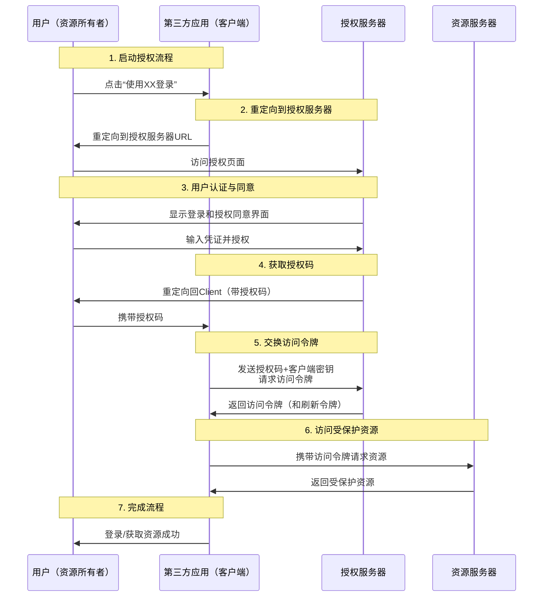

### 一、OAuth 是什么？

**OAuth**（Open Authorization）是一个**开放标准授权框架**，它允许用户在不提供密码的情况下，授权第三方应用访问自己存储在另一个服务提供商上的特定资源。

简单来说，OAuth 解决了 **“授权”** （Authorization）问题，而不是 **“认证”** （Authentication）问题。
*   **认证**：是证明“你是你”的过程（例如，用密码登录）。
*   **授权**：是决定“你允许某个应用做什么”的过程（例如，允许“某音乐App”访问你的微信头像和昵称）。

一个经典的类比是**酒店门卡**：
*   你（**资源所有者**）在酒店前台（**认证服务器**）用身份证和信用卡（认证）开房。
*   前台给你一张设定好权限（只能进入特定房间、在特定时间段内有效）的门卡（**访问令牌**）。
*   你不需要给服务员你的身份证或信用卡，只需出示这张门卡（令牌），服务员（**第三方应用**）就能为你打开房门（**资源服务器**）。

---

### 二、为什么需要 OAuth？它解决了什么问题？

在 OAuth 出现之前，如果一个小应用想访问你的谷歌网盘数据，唯一的办法是你把谷歌的**用户名和密码**交给这个小应用。这会带来巨大的风险：

1.  **密码泄露**：应用可以完全访问你的账户，而不仅仅是它声称需要的功能。
2.  **无法限制权限**：你不能限制应用只能“读”文件，而不能“删除”文件。
3.  **无法撤销访问**：除非你修改密码，否则应用会一直有访问权，这会影响到所有其他使用同一密码的应用。
4.  **信任问题**：你不得不完全信任这个第三方应用。

OAuth 通过引入**令牌机制**完美地解决了这些问题：
*   **权限细分**：你可以精确授权应用访问特定资源（如只读通讯录）。
*   **没有密码共享**：应用永远拿不到你的密码。
*   **访问可撤销**：你可以随时在服务提供商那边取消授权，而无需修改密码。

---

### 三、OAuth 2.0 中的关键角色

OAuth 2.0 定义了四个主要角色：

1.  **资源所有者**：通常就是用户自己，有权授权他人访问其受保护资源的人。
2.  **客户端**：试图访问用户资源的第三方应用程序（如一个网页、手机App等）。
3.  **授权服务器**：在成功认证用户并获得授权后，向客户端颁发访问令牌的服务器（这是负责发“门卡”的前台）。
4.  **资源服务器**：存放用户受保护资源的服务器（这是你存放物品的“房间”）。它接收并验证访问令牌，然后返回相应的资源。授权服务器和资源服务器可以是同一台，也可以是分开的。

---

### 四、OAuth 2.0 的核心授权流程（授权码模式）

最常用、最安全的是**授权码模式**，其流程如下图所示，整个过程涉及多个步骤和角色之间的交互：

以下是每个步骤的详细说明：

**步骤 1：用户点击授权**
用户在一个第三方应用（客户端）中点击“使用微信登录”或“关联谷歌网盘”等按钮。

**步骤 2：重定向到授权服务器**
客户端将用户重定向到授权服务器的地址。这个请求中包含：
*   `client_id`：第三方应用的标识ID（公开）
*   `redirect_uri`：授权成功后用户应被送回的地址
*   `response_type=code`：表示要求返回授权码
*   `scope`：请求的权限范围（如：只读用户信息）
*   `state`：一个随机生成的字符串，用于防止CSRF攻击。

**步骤 3：用户认证与同意**
用户在授权服务器的页面上输入自己的凭证（用户名/密码）进行登录。然后，服务器会明确告知用户客户端请求的权限范围，用户选择是否同意授权。

**步骤 4：返回授权码**
如果用户同意，授权服务器将用户重定向回之前指定的 `redirect_uri`，并在URL的查询参数中附带一个**授权码**。

**步骤 5：用授权码交换访问令牌**
客户端（在后端服务器上）收到授权码后，向授权服务器的令牌端点发起一个**后台请求**。这个请求包含：
*   上一步获取的授权码
*   `client_id` 和 `client_secret`（应用密钥，必须保密）
*   `redirect_uri`（必须与步骤2中的一致）

**步骤 6：颁发访问令牌**
授权服务器验证所有信息（客户端身份、授权码、重定向URI等）无误后，返回一个 **访问令牌** 通常还有一个 **刷新令牌**。

**步骤 7：访问资源**
现在，客户端可以使用这个访问令牌向资源服务器发起请求了。通常在HTTP请求的 `Authorization: Bearer <访问令牌>` 头中携带令牌。资源服务器验证令牌有效后，返回请求的资源。

---

### 五、其他授权模式

OAuth 2.0 还定义了其他几种模式，用于不同的场景：

1.  **隐式模式**：适用于没有后端的纯前端应用（如单页面应用）。跳过授权码步骤，直接在前端返回访问令牌。**安全性较低，现已不推荐使用**，被PKCE扩展所取代。
2.  **密码模式**：用户直接向客户端提供用户名和密码，客户端用这些信息去换取令牌。**仅适用于高度信任的应用**（例如官方自家应用），一般不推荐。
3.  **客户端凭证模式**：适用于客户端访问自己拥有的资源，而不是用户的资源。是机器对机器的通信（如后台数据同步）。
4.  **刷新令牌**：一种扩展机制，访问令牌通常有效期较短，过期后可以用刷新令牌来获取新的访问令牌，而无需用户再次授权。

---

### 六、OAuth 与 OpenID Connect 的区别

这是一个常见的混淆点。

*   **OAuth 2.0**：是一个**授权框架**，解决的是“**允许这个应用访问我的数据吗？**”的问题。它不关心用户是谁。
*   **OpenID Connect**：是建立在 OAuth 2.0 之上的一个**身份层**。它在OAuth流程的基础上，额外返回一个 **ID Token**（通常采用JWT格式），其中包含了用户的身份信息（如用户ID、姓名等）。它解决的是“**这个用户是谁？**”的认证问题。

简单说：**OpenID Connect = OAuth 2.0 + 用户身份认证**。我们现在常用的“使用XXX登录”功能，绝大多数实际实现的是 OpenID Connect。

---

### 总结

| 特性           | 描述                                                         |
| :------------- | :----------------------------------------------------------- |
| **本质**       | 一个授权框架，而非协议或服务                                 |
| **核心**       | 使用**令牌**代替密码，进行安全的API授权                      |
| **关键角色**   | 资源所有者、客户端、授权服务器、资源服务器                   |
| **核心流程**   | **授权码模式**（最安全、最常用）                             |
| **解决的问题** | 让第三方应用在**无需获取用户密码**的前提下，获得对用户资源的**有限访问权限** |
| **不是什么**   | 它不是认证协议（但它是认证协议的基础），它不是身份验证协议（那是OpenID Connect的事） |

希望这份详细的介绍能帮助你全面理解 OAuth！
